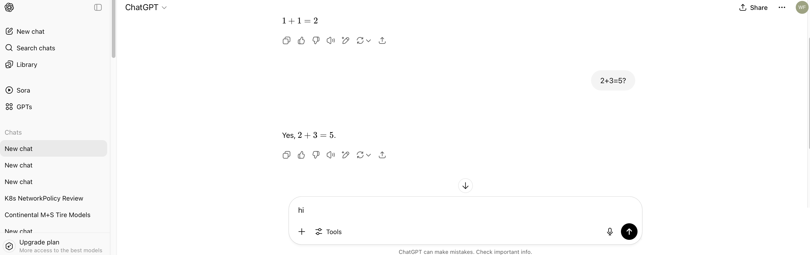

可配置的llm chatbot

前端：
使用react技术栈，界面要类似openai的界面（如附图），界面主要区域分为左侧栏和右侧主对话区域。具体分别和功能如下：
左侧栏最上面是一个”New chat”的按钮，点击可以新建对话，对话将在右侧主对话区域显示；
左侧栏中间部分显示对话历史，当鼠标移到某一条对话记录时，记录右侧显示三个小点的图标，点击该图标，可以对该历史记录做操作，其中包含“删除”和“修改标题名”的操作；
选中对话历史中的某一条记录，则在右侧栏对话详情中显示该条对话的详情；
右侧主对话区域，左上角为“选择模型”下拉菜单，可以选择某一个配置好的模型，选中的条目需要高亮；
“选择模型”右侧是一个“配置模型提供商”按钮，点击可以对模型提供商列表做增删改的操作，每个模型提供商，包含如下信息“api host”, “api key”,“模型列表”（可以填多个模型）；
“选择模型”下拉菜单，显示的模型名称为“模型提供商”+“模型名“这样的格式显示；
右侧主对话区域，中间部分为当前对话的内容，支持多轮对话，支持markdown格式显示；
右侧主对话区域，底部为聊天窗口，用户可以在此的输入框填入想要发送的信息，输入框底部右侧为”发送“按钮，点击即将消息发送给LLM；
右侧主对话区域，底部的聊天窗口，输入框底部左侧为”工具“按钮，点击可以显示更多信息，当前版本仅显示一条”配置LLM“的菜单，点击改菜单，可以配置chat的全局配置，包括如temperature、max token、是否支持stream模式等等配置；

该llm chatbot的后端：
使用python实现，为了安全考虑，需要支持鉴权，可使用oauth协议实现；
后端需要实现必要的接口以供前端调用，包括但不仅限于chat completion, list model providers, list histories等等api；
对于对话历史的保存，当前实现考虑用sqlite，并能支持方便的替换成mysql/postgresql；
配置和对话历史的保存，需要支持多用户；
